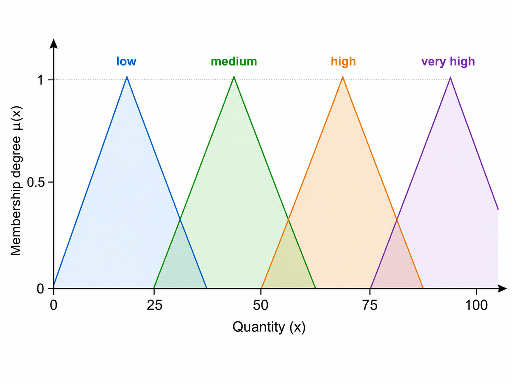

# Fuzzyfier

This repository provides tools to fuzzify and defuzzify ordinal data.

Fuzzy logic is similar to Boolean logic, but instead of only using `False = 0` and `True = 1`, it allows all values between `0` and `1`. This makes it possible to model smooth transitions instead of hard thresholds.

## Fuzzification

For fuzzification, you need a dictionary in the following format:

```python
DICT = {"key": value}
```

You can then apply fuzzification to a given quantity:

```python
fuzzyfied = fuzzyfication(DICT, some_quantity)
```

The `fuzzyfied` class transforms the given dictionary into triangular membership functions and evaluates the provided quantity on these functions.

## Triangular Membership Functions

The fuzzification is based on triangular membership functions.  
Each ordinal category is represented by a triangle, and the membership degree is calculated between `0` and `1`.




## Logical Operations

Using NumPy, fuzzy logical operations can be calculated as follows:

### AND operation

```python
fuzzyfied1 AND fuzzyfied2 = np.min([
    fuzzyfied1.fuzzy()["some key"],
    fuzzyfied2.fuzzy()["some key"]
])
```

Mathematically:

```math
fuzzyfied1 \land fuzzyfied2
```

### OR operation

```python
fuzzyfied1 OR fuzzyfied2 = np.max([
    fuzzyfied1.fuzzy()["some key"],
    fuzzyfied2.fuzzy()["some key"]
])
```

Mathematically:

```math
fuzzyfied1 \lor fuzzyfied2
```

## Defuzzification

If exactly one final result is required, defuzzification can be applied:

```python
fuzzyfied.defuzzification(
    DICT_of_results_from_relevant_conditions,
    list_of_corresponding_values
)
```

This converts the fuzzy rule results back into a single crisp output value.

## Examples

See also the examples:

* `smooth trader`
* `kettle steering`
* `stock picking` (advanced example)
